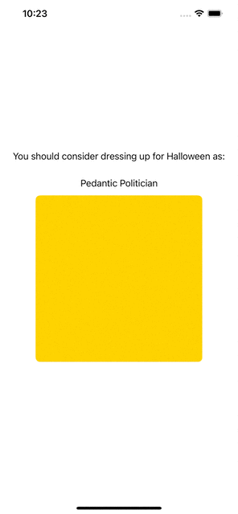

# rockslide

An opinionated micro-framework of tooling to facilitate `Reactive Stream` style composition and `Elm Architecture` inspired one-way data/interaction modeling of user interactions.

The framework is ***opinionated*** in that it codifies several very specific design patterns made possible by the [Reactive Streams Specification (RSS)] (https://www.reactive-streams.org), especially regarding how backpressure, failure modes, and multi-casting / merging are implemented.

Ideally, knowledge of Elm & RSS is entirely optional to successfully use these tools; as the goal is to make their usage intuitive ***enough*** from the API surface design, and the reference examples alone.

## Core Idea
Model your system's data-flow as a collection of isolated components which can `publish` &/or `subscribe` to events across an asynchronous boundary.

Framework consumers are able to define components by declaring the models which they publish/subscribe to, and then implementing their own (possibly stateful) machinery safely hidden inside the isolated component.

Components may then be 'snapped' together by the `~>>` stream operator. 

```swift
authModule() ~>> userManager() ~>> accountDataCache() ~>> socialGraph() ~>> ArticleViewer.self
```

By applying Swift Generics to the Combine.framework tools, the `swiftc` compiler helps us to publish/subscribe the correct models to create valid streams.
And through the opinionated design of `rockslide`'s api, we are guaranteed that the stream will process events / behave in a predictable way.

This leads us to the primary goal of the framework:

***Reason clearly about how individual components, and composed streams will behave, without having to think about the passage of time, or the ordering of events***

## Getting Started

`rockslide` is published as a Swift Package, which can be incorporated into a variety of applications and platforms via SPM by [Adding Package Dependencies to Your App](https://developer.apple.com/documentation/swift_packages/adding_package_dependencies_to_your_app)

The code is pretty small too, and released under the MIT license, so feel free to just cut & paste your way to glory if you prefer!

If you need to verify that you've successfully added the framework to your project, you can temporarily add this to one of your files and make sure the project still compiles:

```swift
import rockslide

struct Test: ReactiveComponent {
    let state = Signal<HalloweenCostume>()
    enum Model { case good, bad }
    typealias UpstreamModel = ()
}
```

For an example of creating a reactive stream with a few basic components and a SwiftUI view, take a look at the Basic Example app included in this repository.

The stream consists of:

1. Halloween Costume Idea generating component which generates random costume ideas, and publishes them sporadically every 2-5 seconds
2. View State Management component. Stripped down and trivialized for this example, but an intermediate component which subscribes to the costume generator, and can publish loading, error, and data view states
3. SwiftUI.View rendering component to display the results of our stream as the random costume ideas arrive.



## Learn more

The data-flow bindings and tooling provided prefer `one-way data flow`, and are generally in line with the concepts from [The Elm Architecture](https://guide.elm-lang.org/architecture/).

While SwiftUI was also somewhat inspired by Elm, Apple allows SwiftUI authors to use two-way data flow techniques and patterns which are common in other reactive UI frameworks and architectures, like Angular.js.

`rockslide` tries to make it easy to do `one-way`, so you don't have to think about the streams that two-way data flow enables.

Reactive Streams and Functional Programming ideas are also prominent in `rockslide`, and reading [The Reactive Manifesto](https://www.reactivemanifesto.org) is a great place to start if you're new to the concept.
